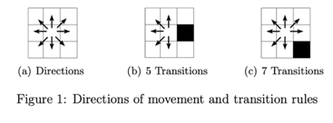

# Grid-Navigation (Based on A-star Algorithm)

### The Problem
Consider a grid of size N x N that represents a topographic map. Each tile describes the characteristics of its terrain, which could be of two types: normal or mountainous. ROBBIE the robot must navigate from a starting position (xs,ys) to a goal position 
(xg,yg) using a learned algorithms (there can only be one start and one goal). 
Note: In the explanations below, we assume that tile (1,1) is the top-left tile in the map. 

### Transition rules
ROBBIE is allowed to go to one of the (at most) eight surrounding tiles, as shown in Figure 1(a). However, it cannot move to a mountainous tile, and it cannot move diagonally if one of the directions composing the diagonal contains a mountainous tile. For instance, the black tile in Figure 1(b) represents a mountain, hence ROBBIE can move only to the five white tiles indicated by the arrows. In contrast, ROBBIE can move to seven tiles in Figure 1(c). 

### Path cost
ROBBIE’s wheels are built so that a diagonal move is the easiest. Hence, the cost of 
such a move is 1. Any other move has a cost of 2. 

### The Task
Task is to write a Python 3 program called planpath that plans a path from a given starting tile to a goal tile. 
You should implement either Graph or Treesearch procedure to perform A*. 

### Calling the program
The program will have two command line arguments as follows:
`python planpath.py INPUT/inputi.txt OUTPUT/outputi.txt flag`
* inputi.txt – the name of the input file, where i is the number of the input file 
* outputi.txt – the name of the output file, where i is the number of the output 
file
* flag – indicates how many node expansions require a diagnostic output (if it 
is 0, no diagnostic output is required)

#### Input
The first line will contain one number that specifies the number of rows and columns in the map. Subsequent lines will contain the map, one line per row. The following values will be accepted for each tile,

#### Output
* Program produces a sequence of moves that ROBBIE should perform to get from the start node to the goal, and the accumulated cost and ROBBIE’s position after each move
* The sequence of moves is formatted as a list of actions separated by dashes followed by a blank space and the cost of the path according to the algorithm. If no path was found, the output states NO-PATH
* The actions (in UPPER CASE) are: R (Right), RD (Diagonal Right-Down), D (Down), LD (Diagonal Left-Down), L (Left), LU (Diagonal Left-Up), U (Up), RU (Diagonal Right-Up)
* For example, a path that goes Start, Right, Right-Down, Down, Down, Left- Down and Goal, with a total cost of 8, is represented as follows: S-R-RD-D-D-LD-G 8

## Reference for detailed explanation of A* algorithm
https://medium.com/@nicholas.w.swift/easy-a-star-pathfinding-7e6689c7f7b2